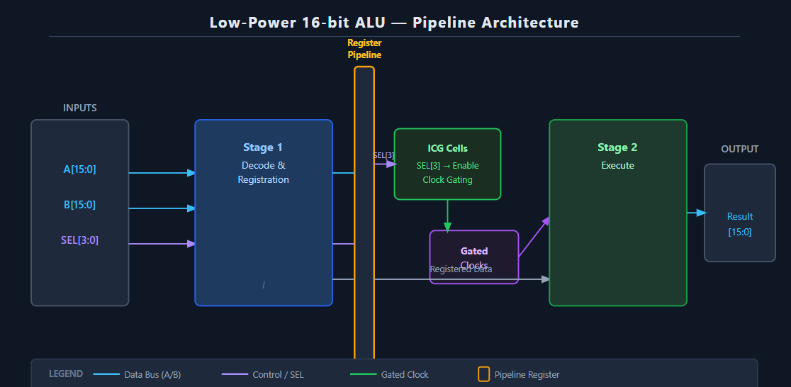
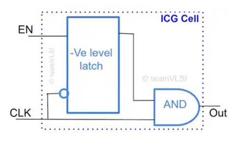
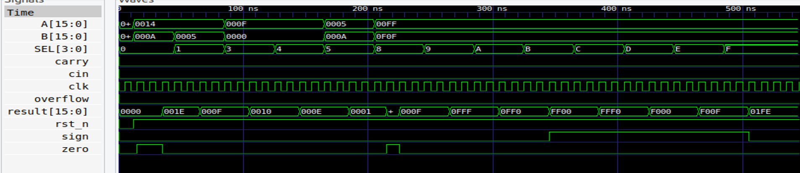
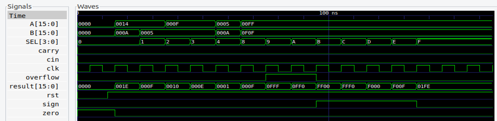
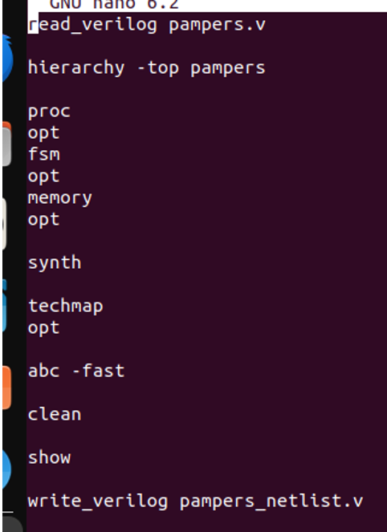
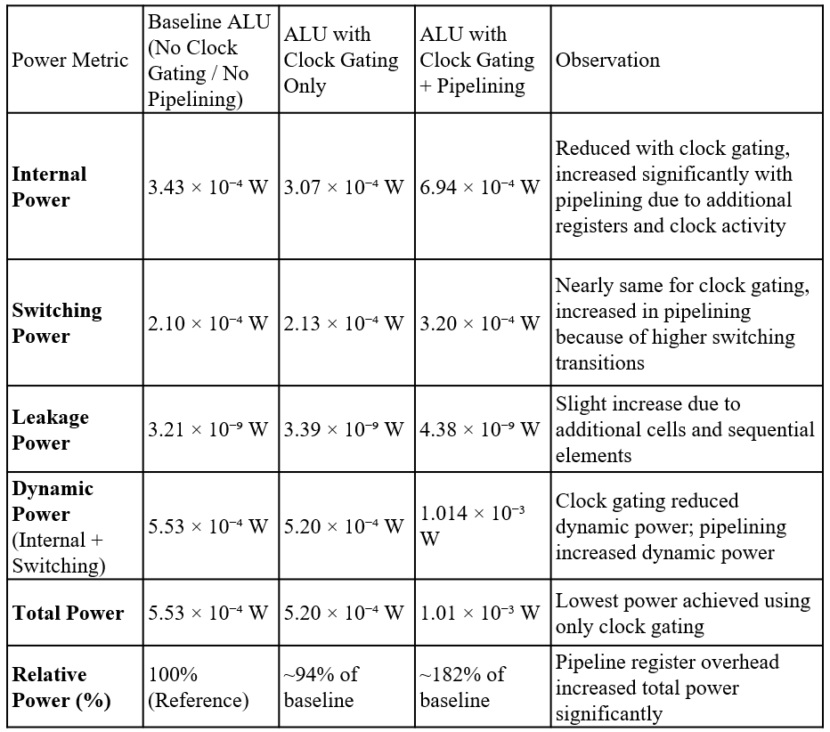
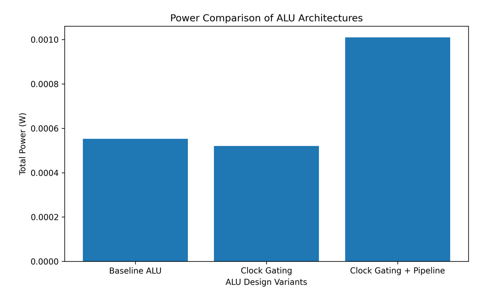

# Low-Power 16-bit ALU using Integrated Clock Gating and 2-Stage Pipelining

A Verilog HDL implementation of a **16-bit Arithmetic Logic Unit (ALU)** optimized using **Integrated Clock Gating (ICG)** and a **2-stage pipelined architecture**. This project evaluates the impact of these low-power design techniques on power consumption and performance using open-source ASIC design tools.

---

## Project Overview

Power consumption is one of the major challenges in modern VLSI design. This project investigates two widely adopted low-power techniques:

- Integrated Clock Gating (ICG)
- Two-Stage Pipelining

Three different ALU architectures were implemented, verified, synthesized, and analyzed:

- Baseline 16-bit ALU
- Clock-Gated 16-bit ALU
- Clock-Gated + 2-Stage Pipelined 16-bit ALU

---

## Project Contribution

This project was completed as part of a team mini-project.

My primary contributions included:
- RTL design in Verilog HDL
- Integrated Clock Gating implementation
- Two-stage pipelined architecture
- Functional verification and testbench development
- Logic synthesis using Yosys
- Power analysis using OpenSTA/OpenLane

The uploaded report and presentation are the original course submission prepared by the project team.

---

## Features

- 16-bit ALU designed in Verilog HDL
- Arithmetic and Logical Operations
- Integrated Clock Gating
- Two-Stage Pipeline
- Functional Verification using Testbenches
- Logic Synthesis using Yosys
- Power Analysis using OpenSTA/OpenLane

---

## Supported Operations

- Addition
- Subtraction
- AND
- OR
- XOR
- NOT
- Logical Shift Left
- Logical Shift Right

---

# Architecture

The proposed ALU architecture consists of:

- Input Interface
- Decode & Register Stage
- Pipeline Register
- Integrated Clock Gating Cell
- Execute Stage
- Output Stage

The architecture separates instruction decoding and execution while reducing unnecessary clock switching through Integrated Clock Gating.



---

# Integrated Clock Gating

Clock gating minimizes unnecessary switching activity by disabling the clock when functional units are idle, thereby reducing dynamic power consumption.

### ICG Cell



### Clock Gating Architecture



---

# Functional Verification

Each ALU implementation was verified using dedicated Verilog testbenches.

Simulation was performed using **Icarus Verilog**, and waveforms were analyzed using **GTKWave**.

### Baseline ALU Simulation



---

# Logic Synthesis

RTL synthesis was performed using the **Yosys Open Synthesis Suite**.

The synthesized design was analyzed for implementation feasibility and hardware resource utilization.



---

# Power Analysis

Power estimation was performed after synthesis using open-source ASIC tools.

Three architectures were compared:

- Baseline ALU
- Clock-Gated ALU
- Clock-Gated + 2-Stage Pipelined ALU

The results demonstrate that Integrated Clock Gating effectively reduces unnecessary switching activity, while pipelining introduces additional sequential elements that increase clock-tree power. This highlights the practical engineering trade-off between power optimization and performance.

---

### Key Observations

- The **Clock-Gated ALU** showed a reduction in total power compared to the baseline implementation by reducing unnecessary clock switching activity.
- The **Clock-Gated + 2-Stage Pipelined ALU** exhibited an **approximately 82% increase in total power compared to the baseline**.

This increase was primarily due to the introduction of additional **pipeline registers**, which increased clock-tree activity and sequential logic power.

Furthermore, because the ALU is a relatively small hardware block, the overhead introduced by pipelining outweighed its potential performance benefits from a power perspective.



---

# Repository Structure

```
low-power-16bit-alu
│
├── rtl/
├── testbench/
├── scripts/
├── images/
├── reports/
├── presentation/
└── README.md
```

---

# Tools Used

- Verilog HDL
- Icarus Verilog
- GTKWave
- Yosys Open Synthesis Suite
- OpenSTA
- OpenLane
- Git
- GitHub

---

# Results & Key Findings

This project successfully demonstrates:

- RTL design using Verilog HDL
- Functional verification using testbenches
- Integrated Clock Gating implementation
- Two-stage pipeline architecture
- Logic synthesis using Yosys
- Power estimation using open-source ASIC tools

### Engineering Insight

One of the most important outcomes of this project was that the experimental results differed from the initial expectation.

Initially, it was expected that combining **clock gating** with **pipelining** would reduce the overall power consumption. While clock gating alone reduced power, the addition of pipelining resulted in an approximately **82% increase in total power compared to the baseline implementation**.

This occurred because the additional pipeline registers increased clock distribution and sequential logic overhead. Since the ALU is a relatively small design, the overhead introduced by these registers became a significant portion of the total power consumption.

This observation highlights an important VLSI design principle:

> **Pipelining improves throughput and timing performance, but it does not necessarily reduce power. For smaller circuits, the additional register overhead can outweigh its benefits.**

This project demonstrates the importance of evaluating architectural optimizations through quantitative analysis rather than assuming they always improve every design metric.



---

# Future Improvements

Potential enhancements include:

- Carry Lookahead ALU
- Parameterized ALU Design
- Multi-stage Pipeline
- FPGA Implementation
- Static Timing Analysis (STA)
- Complete RTL-to-GDSII Physical Design Flow

---

# References

- David Harris & Sarah Harris – *Digital Design and Computer Architecture*
- Weste & Harris – *CMOS VLSI Design*
- Yosys Open Synthesis Suite
- OpenLane ASIC Flow

---

# Author

**Harshitha A**

B.Tech – VLSI Design and Technology

Nitte Meenakshi Institute of Technology (NMIT), Bengaluru
